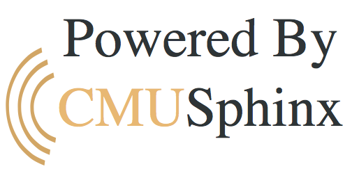

# CMUSphinx for Golang 



## Intro

[CMUSphinx](http://cmusphinx.sourceforge.net) collects over 20 years of the CMU research. All advantages are hard to list, but just to name a few:

* State of art speech recognition algorithms for efficient speech recognition. CMUSphinx tools are designed specifically for low-resource platforms;
* Flexible design;
* Focus on practical application development and not on research;
* Support for several languages like US English, UK English, French, Mandarin, German, Dutch, Russian and ability to build a models for others;
* BSD-like license which allows commercial distribution;
* Active development and release schedule;
* Active community (more than 400 users on Linkedin CMUSphinx group);
* Wide range of tools for many speech-recognition related purposes (keyword spotting, alignment, pronuncation evaluation).

Refer to http://cmusphinx.sourceforge.net/wiki/ for the futher info.

## This project

The main aim of the **pocketsphinx-go** project is to bring all those features to the Go programming language. Firstly,
by leveraging awesome [cgogen](http://git.io/cgogen) framework (not yet released, sorry) I was able to create full-featured
bindings to the pocketsphinx core library and sphinxbase just in a few hours of config tweaking. Secondly, I added a high-level wrapper package on top of that so users won't be bothered too much by rough API and lack of documentation in godoc. The code is from the edge of both upstreams, so any new features added like yesterday will be automatically there in no time.

### package [pocketsphinx](/pocketsphinx) [](https://godoc.org/github.com/xlab/pocketsphinx-go/pocketsphinx)

Package **pocketsphinx** provides Go bindings for pocketsphinx, one of Carnegie Mellon University's open source large vocabulary, speaker-independent continuous speech recognition engine. Pocketsphinx is a library that depends on another library called SphinxBase which provides common functionality across all CMUSphinx projects. All the binding code has automatically been generated with rules defined in [pocketsphinx.yml](/pocketsphinx.yml). This tries to cover as much as possible of the API, if you missing some method or type you'd like to see here — just create an issue and it'll be there.

Examples of use: [sphinx/lattice.go](sphinx/lattice.go), and others from the sphinx package.

### package [sphinx](/sphinx) [](https://godoc.org/github.com/xlab/pocketsphinx-go/sphinx)

Package **sphinx** is a top-level wrapper for PocketSphinx API exposed by the autogenerated **pocketsphinx** package. It is hand written and covers almost everything you'd like to have from PhocketSphinx: the decoder, lattices, n-grams, mllr and log-math. There is a possibility to add `fsg`, `fe` and `feat` modules in a few hours, but I was too lazy to get them done in the first place, let me know if you need them too by creating an issue. Actually they are from SphinxBase rather than from the public set of methods of PocketSphinx. This one is the main package you should use to work ith CMUSphinx. It tries to simplify its methods for use from Go and provides a complete documentation as the original code does.

Examples of use: [gortana/main.go](/example/gortana/main.go).

## Installation

In order to start experimenting with sphinx you need to install the latest version from sources, do not use any pre-packaged versions as the latest stable release was in 2008 and since then they continiuously working on the software in "pre-alpha" mode, that means the master branch in the upstream. So installation is simple, just follow their instaructions.

1. Install https://github.com/cmusphinx/sphinxbase - this should go fast. Better to install to `/usr/local`.
2. Install https://github.com/cmusphinx/pocketsphinx - this one depends on sphinxbase and contains models for language and dictionaries, so expect to download 200M of data. Better to install to `/usr/local`.

In both cases it can be done like this:

```
./autogen.sh
make
make install
```

And finally get the **sphinx** package:

```
$ go get github.com/xlab/pocketsphinx-go/sphinx
```

It will locate the pocketsphinx installation using `pkg-config`.

## Example

There is an example program called [gortana](/example/gortana) that simply listens to your speech in continious mode and triest to recognize something. I haven't managed to recognize "gopher" but any common-ish sentences it gets right, the stock HMM, LM and Dict are good. For input it uses [portaudio-go](https://github.com/xlab/portaudio-go). So you will need to get portaudio installed first.

```
$ brew install portaudio
$ go get github.com/xlab/pocketsphinx-go/example/gortana
$ gortana --help
 __
/ _  _  _|_ _  _  _
\__)(_)| |_(_|| )(_|

Usage: gortana [OPTIONS]

Goratana is a dumb personal assistant to test how CMUSphinx works from Golang.

Options:
  --hmm="/usr/local/share/pocketsphinx/model/en-us/en-us"                 Sets directory containing acoustic model files.
  --dict="/usr/local/share/pocketsphinx/model/en-us/cmudict-en-us.dict"   Sets main pronunciation dictionary (lexicon) input file..
  --lm="/usr/local/share/pocketsphinx/model/en-us/en-us.lm.bin"           Sets word trigram language model input file.
  --log="gortana.log"                                                     Log file to write log to.
  --stdout=false                                                          Disables log file and writes everything to stdout.
  --outraw=""                                                             Specify output dir for RAW recorded sound files (s16le). Directory must exist.
```

By default it writes to the log, but if something seems strange, you may enable stdout logging instead and see everything what's going on. Paths for HMM, LM and Dict are based upon standard installation to `/usr/local`. And one more thing: there is an option to write every utterance sphinx had processesed to some dir and this directory should exist, otherwise gortana won't start. Then you can simply play them with ffplay from ffmpeg:

```
$ ffplay -f s16le -ar 16000 -ac 1 -i out/000000000.raw
```

## Rebuilding the package

You will need to get the [cgogen](https://git.io/cgogen) tool installed first.

```
$ git clone https://github.com/xlab/pocketsphinx-go && cd pocketsphinx-go
$ make clean
$ make
```

## Contributing

Feel free to share bugs, especially when method signature doesn't look like expected (`[]` instad of `*`, etc).
Please also share this project in social networks so more people would know how to use offline voice recognition
in their Go apps. Follow me at [@xlab_dev](https://twitter.com/xlab_dev).

## License

All the code except when stated otherwise is licensed under the MIT license.
